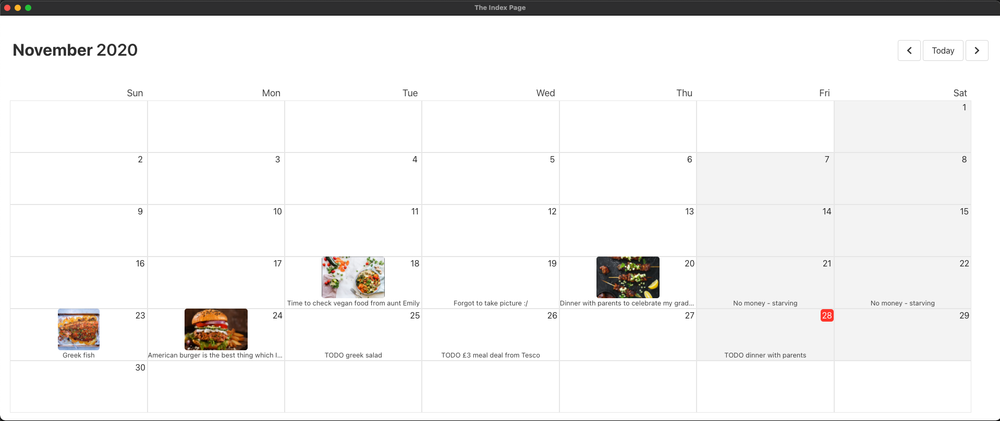
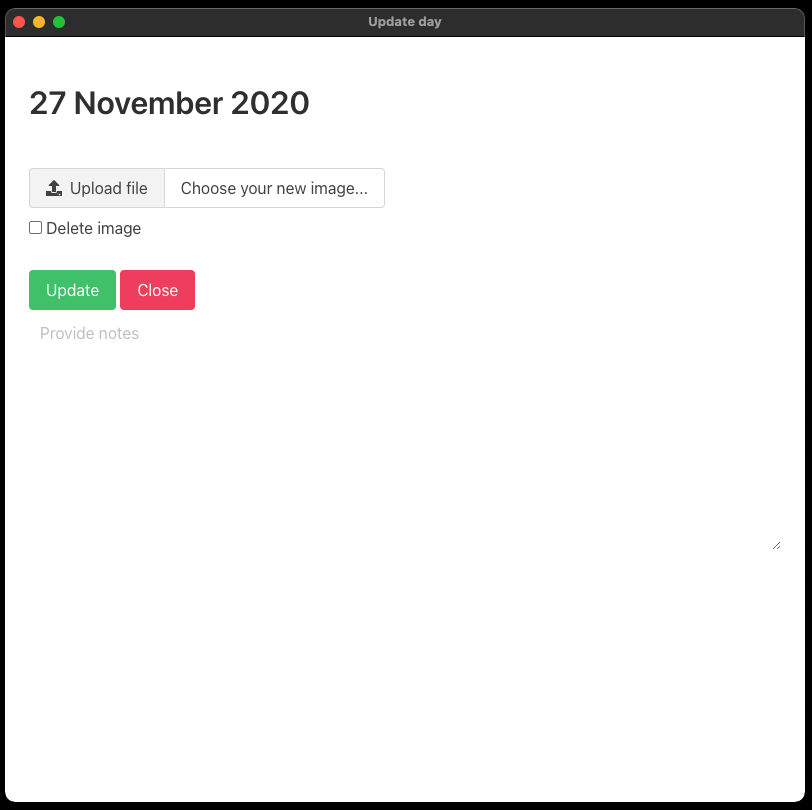
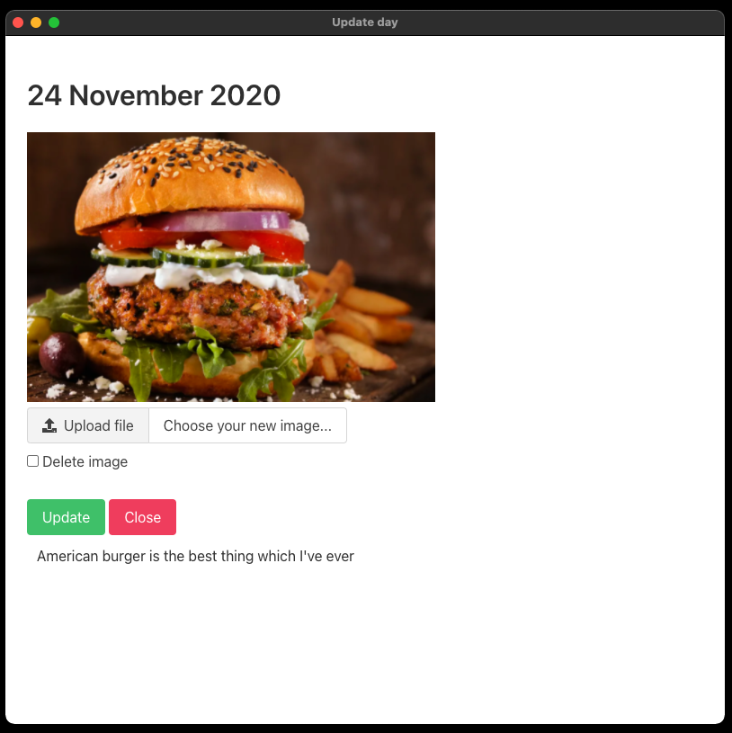

# Food Calendar [November 2020]

Desktop application to provide pictures of food (or anything else!) with notes to the calendar.
With using Electron, application can be run on many operation systems (Windows, MacOS, Linux)

## Screenshots from running app







## Technologies

- Electron (NodeJS + Chromium)
- EJS (Javascript templating)
- Bulma (CSS framework)
- HTML

## Where are saved data?

Data (includes notes and images) is store under "App Data" folder which has got different location for each operation system:

Linux: `~/.config/food-calendar`

Mac OS: `~/Library/Application Support/food-calendar`

Windows: `C:\Users\<user>\AppData\Local\food-calendar`

## How to run app?

Install dependencies from `package.json`:

```
npm install
```

Run application:

```
npm start
```

## More links

The guide which I followed and will be able to explain most of the logic provided here with using Electron:
https://codeburst.io/build-a-todo-app-with-electron-d6c61f58b55a
